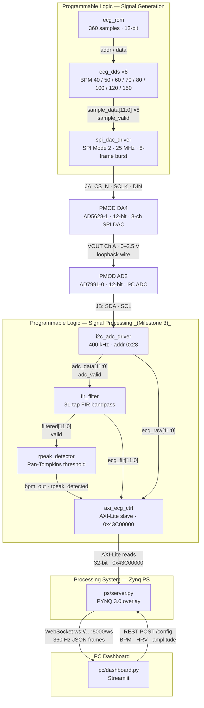

# Architecture

## System Overview

The PYNQ-Z2 ECG Demo generates realistic 12-bit ECG waveforms in programmable logic (PL), outputs them as analog signals through a PMOD DA4 (AD5628-1) DAC, loops the analog signal back into a PMOD AD2 ADC, and streams the digitised samples over a WebSocket from the Zynq PS to a Streamlit dashboard running on a PC. The PS also exposes a REST API that the dashboard uses to configure per-channel heart rate, HRV, and amplitude parameters at runtime via AXI-Lite registers.

---

## Block Diagram



---

## Layer Summary

| Layer | Technology | Responsibility |
|---|---|---|
| PL — Signal Generation | Verilog (Vivado) | Synthesise ECG waveform; drive DAC via SPI |
| PL — Signal Processing | Verilog (Vivado) | FIR filter, R-peak detection, AXI registers |
| Hardware — DAC | PMOD DA4 / AD5628-1 on JA | 12-bit 8-channel SPI DAC; Ch A used for loopback |
| Hardware — ADC | PMOD AD2 on JB | XADC-compatible analogue input |
| PS — Server | Python / PYNQ overlay | Read AXI regs, stream samples, serve REST API |
| PC — Dashboard | Streamlit | Display waveform, BPM, sliders for config |

---

## Signal Generation Block

### Inputs

| Port | Width | Description |
|---|---|---|
| `clk` | 1 | 100 MHz system clock |
| `rst_n` | 1 | Active-low synchronous reset |
| `bpm_ch_a` … `bpm_ch_h` | 8 each | Per-channel heart rate, 30–240 BPM |
| `rr_fluct` | 8 | RR interval variation magnitude, 0–255 |
| `amp_fluct` | 8 | Peak amplitude variation magnitude, 0–255 |

### Outputs

| Port | Width | Description |
|---|---|---|
| `dac_cs_n` | 1 | SPI chip-select (active low) to PMOD DA4 |
| `dac_sclk` | 1 | SPI clock (25 MHz, CPOL=1 CPHA=0) |
| `dac_din` | 1 | SPI data (MSB first, 24 bits per channel frame) |
| `sample_valid_out` | 1 | Ch A sample strobe — 1 pulse per sample at 360 Hz default |

### Key Parameters

| Parameter | Value |
|---|---|
| ROM depth | 360 samples (one cardiac cycle, MIT-BIH Record 100 Lead II) |
| Sample rate | `bpm × 6` Hz per channel (default 360 Hz at 60 BPM) |
| DAC resolution | 12 bits unsigned (0–4095) |
| DAC channels driven | 8 (Ch A–H), each with independent DDS phase counter |
| SPI word format | 24 bits: CMD[23:20] ADDR[19:16] DATA[15:4] DC[3:0] |
| HRV mechanism | 8-bit LFSR modulates reload counter per cardiac cycle |
| Amplitude mechanism | Independent 8-bit LFSR scales ROM sample by ±`amp_fluct`/2 |
| Source files | See `pl/ecg_rom.v`, `pl/ecg_dds.v`, `pl/spi_dac_driver.v`, `pl/ecg_signal_gen_top.v` |

---

## Signal Processing Pipeline

### Flow

```
ADC (12-bit samples, 360 Hz)
  │
  ▼
FIR Bandpass Filter  (31-tap, 0.5–40 Hz, Q1.15, Hamming window)
  │  latency: 15 clock cycles
  ▼
R-Peak Detector  (Pan-Tompkins threshold, refractory = 72 samples)
  │  outputs: bpm_out (16-bit), rpeak_detected (1-bit)
  ▼
AXI-Lite Registers  (base 0x43C00000)
  │  readable by PS via PYNQ overlay
  ▼
PS / WebSocket → PC Dashboard
```

### Key Parameters

| Parameter | Value | Source |
|-----------|-------|--------|
| FIR taps | 31 | `handoffs/algorithm_spec.md` |
| Passband | 0.5 – 40.0 Hz | algorithm_spec.md |
| Window | Hamming | algorithm_spec.md |
| Q format | Q1.15 (16-bit signed) | algorithm_spec.md |
| Accumulator | 32-bit signed | algorithm_spec.md |
| Output truncation | `acc >> 15`, bits [11:0] | algorithm_spec.md |
| Filter latency | 15 clock cycles | algorithm_spec.md |
| R-peak algorithm | Simplified Pan-Tompkins | algorithm_spec.md |
| Detection threshold | 2983 (12-bit, 0.70 × max) | algorithm_spec.md |
| Refractory period | 72 samples (200 ms @ 360 Hz) | algorithm_spec.md |
| BPM formula | `(360 × 60) / sample_interval` | algorithm_spec.md |
| Interval counter | 16-bit (saturates → BPM = 0) | algorithm_spec.md |
| SNR improvement | 11.7 dB (validated) | `algo/validate_algorithm.py` |
| R-peak detection rate | 100.0% on validation signal | algo/validate_algorithm.py |

RTL implementation: `pl/fir_filter.v`, `pl/rpeak_detector.v` _(Milestone 3)_.
Full algorithm detail: `docs/algorithm_summary.md`.

---

## Vivado Block Design

### IP Blocks Required

| IP Block | Instance Name | Notes |
|----------|---------------|-------|
| Zynq-7000 PS | `processing_system7_0` | Enable AXI GP0 master port; configure DDR and UART as needed |
| AXI Interconnect | `axi_interconnect_0` | 1 master (PS GP0), 1 slave (ecg_process_top S_AXI) |
| ecg_signal_gen_top | `ecg_signal_gen_top_0` | Custom IP; add `pl/` sources as design sources |
| ecg_process_top | `ecg_process_top_0` | Custom IP; includes fir_filter, rpeak_detector, axi_ecg_ctrl |
| Processor System Reset | `proc_sys_reset_0` | Drives `peripheral_aresetn` to custom IPs |
| Clocking Wizard | `clk_wiz_0` | Input: 125 MHz PS FCLK_CLK0; Output: 100 MHz system clock |

### Connection Summary

| From | To | Signal |
|------|----|--------|
| `processing_system7_0` FCLK_CLK0 | `clk_wiz_0` clk_in1 | 125 MHz reference clock |
| `clk_wiz_0` clk_out1 | `ecg_signal_gen_top_0` clk | 100 MHz system clock |
| `clk_wiz_0` clk_out1 | `ecg_process_top_0` clk | 100 MHz system clock |
| `clk_wiz_0` clk_out1 | `axi_interconnect_0` ACLK | 100 MHz AXI clock |
| `clk_wiz_0` clk_out1 | `proc_sys_reset_0` slowest_sync_clk | Clock for reset synchroniser |
| `processing_system7_0` FCLK_RESET0_N | `proc_sys_reset_0` ext_reset_in | PS reset source |
| `proc_sys_reset_0` peripheral_aresetn | `ecg_signal_gen_top_0` rst_n | Active-low reset |
| `proc_sys_reset_0` peripheral_aresetn | `ecg_process_top_0` rst_n | Active-low reset |
| `proc_sys_reset_0` interconnect_aresetn | `axi_interconnect_0` ARESETN | AXI interconnect reset |
| `processing_system7_0` M_AXI_GP0 | `axi_interconnect_0` S00_AXI | PS AXI master to interconnect |
| `axi_interconnect_0` M00_AXI | `ecg_process_top_0` S_AXI | AXI slave at 0x43C00000 |
| `ecg_signal_gen_top_0` sample_valid_out | `ecg_process_top_0` sample_trigger | 360 Hz sample strobe |
| `ecg_process_top_0` bpm_ch_a … bpm_ch_h | `ecg_signal_gen_top_0` bpm_ch_a … bpm_ch_h | Per-channel BPM [7:0] |
| `ecg_process_top_0` rr_fluct | `ecg_signal_gen_top_0` rr_fluct | HRV magnitude [7:0] |
| `ecg_process_top_0` amp_fluct | `ecg_signal_gen_top_0` amp_fluct | Amplitude variation [7:0] |
| `ecg_signal_gen_top_0` dac_cs_n / dac_sclk / dac_din | Board pins V15 / T10 / W15 (JA) | SPI to PMOD DA4 |
| `ecg_process_top_0` adc_sda / adc_scl | Board pins W12 / W11 (JB) | I2C to PMOD AD2 |

### Address Editor Settings

| Slave | Offset Address | Range | High Address |
|-------|---------------|-------|--------------|
| `ecg_process_top_0` S_AXI | `0x43C0_0000` | 64K | `0x43C0_FFFF` |

### Build Steps (summary)

1. Create a new Vivado RTL project targeting the PYNQ-Z2 (xc7z020clg400-1).
2. Add all `pl/*.v` files as design sources.
3. Add `pl/constraints.xdc` as a constraints source.
4. Create a new Block Design; add and connect IP as listed above.
5. Right-click the block design → **Validate Design**.
6. Right-click the block design → **Create HDL Wrapper** (let Vivado manage the wrapper).
7. Run **Generate Bitstream**; export `.bit` and `.hwh` to `ps/`.

---

_Last updated: Milestone 3 — Signal Processing_
