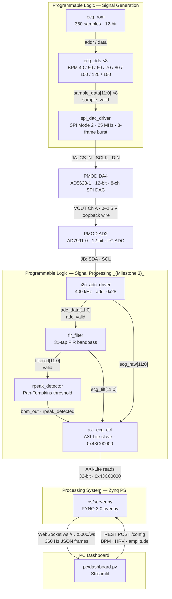

# Architecture

## System Overview

The PYNQ-Z2 ECG Demo generates realistic 12-bit ECG waveforms in programmable logic (PL), outputs them as analog signals through a PMOD DA4 (AD5628-1) DAC, loops the analog signal back into a PMOD AD2 ADC, and streams the digitised samples over a WebSocket from the Zynq PS to a Streamlit dashboard running on a PC. The PS also exposes a REST API that the dashboard uses to configure per-channel heart rate, HRV, and amplitude parameters at runtime via AXI-Lite registers.

---

## Block Diagram

---

## Layer Summary

| Layer | Technology | Responsibility |
|---|---|---|
| PL — Signal Generation | Verilog (Vivado) | Synthesise ECG waveform; drive DAC via SPI |
| PL — Signal Processing | Verilog (Vivado) | FIR filter, R-peak detection, AXI registers |
| Hardware — DAC | PMOD DA4 / AD5628-1 on JA | 12-bit 8-channel SPI DAC; Ch A used for loopback |
| Hardware — ADC | PMOD AD2 on JB | XADC-compatible analogue input |
| PS — Server | Python / PYNQ overlay | Read AXI regs, stream samples, serve REST API |
| PC — Dashboard | Streamlit | Display waveform, BPM, sliders for config |

---

## Signal Generation Block

### Inputs

| Port | Width | Description |
|---|---|---|
| `clk` | 1 | 100 MHz system clock |
| `rst_n` | 1 | Active-low synchronous reset |
| `bpm_ch_a` … `bpm_ch_h` | 8 each | Per-channel heart rate, 30–240 BPM |
| `rr_fluct` | 8 | RR interval variation magnitude, 0–255 |
| `amp_fluct` | 8 | Peak amplitude variation magnitude, 0–255 |

### Outputs

| Port | Width | Description |
|---|---|---|
| `dac_cs_n` | 1 | SPI chip-select (active low) to PMOD DA4 |
| `dac_sclk` | 1 | SPI clock (25 MHz, CPOL=1 CPHA=0) |
| `dac_din` | 1 | SPI data (MSB first, 24 bits per channel frame) |
| `sample_valid_out` | 1 | Ch A sample strobe — 1 pulse per sample at 360 Hz default |

### Key Parameters

| Parameter | Value |
|---|---|
| ROM depth | 360 samples (one cardiac cycle, MIT-BIH Record 100 Lead II) |
| Sample rate | `bpm × 6` Hz per channel (default 360 Hz at 60 BPM) |
| DAC resolution | 12 bits unsigned (0–4095) |
| DAC channels driven | 8 (Ch A–H), each with independent DDS phase counter |
| SPI word format | 24 bits: CMD[23:20] ADDR[19:16] DATA[15:4] DC[3:0] |
| HRV mechanism | 8-bit LFSR modulates reload counter per cardiac cycle |
| Amplitude mechanism | Independent 8-bit LFSR scales ROM sample by ±`amp_fluct`/2 |
| Source files | See `pl/ecg_rom.v`, `pl/ecg_dds.v`, `pl/spi_dac_driver.v`, `pl/ecg_signal_gen_top.v` |

---

_Last updated: Milestone 1 — Signal Generation_
