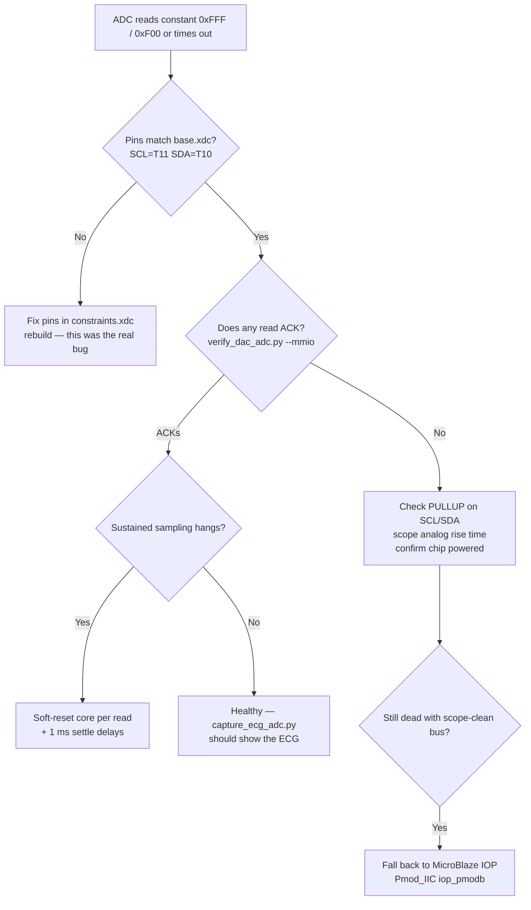

# Lessons Learned — PMOD DA4 (DAC) & PMOD AD2 (ADC)

Hard-won lessons from bringing up the two analog PMODs on the PYNQ-Z2:
**PMOD DA4** (AD5628-1 SPI DAC) and **PMOD AD2** (AD7991-0 I²C ADC). Most of the
pain came from a handful of mundane root causes — bank these before touching the
analog path again. Chronology lives in `handoffs/milestone_log.md`; on-hardware
checks live in `verification/`.

---

## TL;DR

| Symptom | Real root cause | Fix |
|---|---|---|
| ADC "won't ACK" / reads `0xF00`/`0xFFF` | **Wrong pins** — drove SCL/SDA on pads with no chip | AD7991 is on JB **SCL=T11, SDA=T10**. Verify against `base.xdc` first. |
| DAC stuck at mid-scale (≈2048) | DDS divider overflow on first BPM change | Reset `bpm_prev <= 8'd60` (not 0) + 64-bit overflow guard in `ecg_dds.v`. |
| DAC output garbage / wrong levels | AD5628 frame handling | **32-bit frames + internal-ref enable + CS pulsed per word.** |
| `create_bd_design` fails: "couldn't read init.tcl/utils_dbg.tcl: No error" | **Antivirus** locking Vivado's own scripts (sharing violation) | Pre-read `scripts/ipintegrator/` to warm the AV cache, then launch; or add `C:\Xilinx` to Defender exclusions. |

---

## PMOD AD2 — AD7991-0 I²C ADC

1. **Verify pins against the official `base.xdc` before debugging anything.**
   The repo's original `pl/constraints.xdc` was wrong (JB as W12/W11/V10/W10; `W12`
   isn't even a valid `clg400` pin). The AD7991 is on **JB = SCL T11 / SDA T10**.
   We burned *weeks* "debugging RTL" that was driving pins with no chip attached.
   Source of truth: `vivado/pynq_src/boards/Pynq-Z2/base/vivado/constraints/base.xdc`.

2. **The IP path was never the problem — the pins were.** Earlier conclusion was
   "custom PL-fabric RTL *and* bare AXI-IIC both fail; only a MicroBlaze IOP works."
   That was **disproved on 2026-05-30**: with the correct pins (T11/T10), the
   **Xilinx AXI-IIC IP reads the AD7991 cleanly** (verified, live ECG capture).
   So there are now **two working ADC paths**:
   - **AXI-IIC IP** (lighter, preferred) — read via raw MMIO at `0x41600000`.
   - **MicroBlaze IOP** (`Pmod_IIC`) — heavier fallback, also works.

3. **PYNQ does not auto-bind `axi_iic_0`.** `ip_dict` shows only `ecg_process_top_0`
   + `processing_system7_0`. Use the **raw-MMIO dynamic-mode sequence** instead of
   `overlay.axi_iic_0` (see `verification/verify_dac_adc.py::adc_mmio`).

4. **AXI-IIC dynamic mode needs a soft reset + brief settle *per transaction*.**
   Back-to-back reads without `SOFTR(0x0A)` + `sleep(1 ms)` (and a `sleep(1 ms)`
   between the config write and the read) hang. With the resets, sustained
   sampling at **~367 Hz** is reliable (`verification/capture_ecg_adc.py`).

5. **A digital ILA cannot prove a bus is healthy.** It samples thresholded 1/0 and
   its own IOBUF loopback — a "textbook-perfect" SDA capture can just be the FPGA
   driving its own wrong pin with no slave present. Only a real ACK (or an analog
   scope) proves the link.

6. **I²C pins need `PULLUP true`** in the XDC. The PMOD AD2 also internally shorts
   pins 1↔5 and 2↔6, so the unused bottom-row JB pads sit in parallel with SCL/SDA.

## PMOD DA4 — AD5628-1 SPI DAC

7. **DDS divider overflow froze the DAC at mid-scale (~2048).** `ecg_dds.v` reset
   `bpm_prev <= 8'd0` while `axi_ecg_ctrl` reset BPM to 60 → a spurious divide on
   the first clock, `360<<31` overflowed 32 bits → ~4 billion reload → DDS frozen
   at ROM[0]. Fix: reset `bpm_prev <= 8'd60` **and** add a 64-bit overflow guard.

8. **AD5628 framing matters.** Correct operation needs **full 32-bit SPI frames**,
   **internal-reference enable**, and **CS (SYNC_N) pulsed per word** (not held
   across a burst). See commit `a34fac7`.

9. **The hardware was never the issue.** A DA4→AD2 loopback sweep tracked
   monotonically under the PYNQ base overlay early on — proof the chips, sockets,
   and wiring were fine and every "DAC frozen / ADC NACK" symptom was RTL or pins.

## Build & board environment

10. **Antivirus can break Vivado's `create_bd_design`.** Failures like
    "couldn't read file `init.tcl`/`utils_dbg.tcl`: No error" (Tcl errno 0 =
    Windows **sharing violation**) are Defender scanning Vivado's own
    `scripts/ipintegrator/*.tcl` the instant `vivado.exe` opens them. The file is
    intact and the OS reads it fine — only `vivado.exe` is blocked. Fix: pre-read
    that directory to warm the scan cache, then launch immediately; permanent fix
    is adding `C:\Xilinx` to Defender exclusions. (Shell choice — PowerShell vs
    git-bash — is a red herring; it failed from both.)

11. **OOC IP synth can OOM-crash the JVM.** Lower parallelism: `launch_runs … -jobs 2`.

12. **Overlay load needs root + a sourced env.** A bare `python3` raises
    "No Devices Found"; run with
    `sudo bash -c 'source /etc/profile.d/pynq_venv.sh; source /etc/profile.d/xrt_setup.sh; python3 …'`
    using the venv at `/usr/local/share/pynq-venv`.

13. **PYNQ-Z2 has no battery RTC** — file timestamps on the board are bogus; set the
    clock each boot (`sudo date -s …`) if you care about them.

---

## Decision tree — "the ADC won't return data"

## Where the checks live

- `verification/verify_dac_adc.py` — DAC sweep + ADC ACK, PASS/FAIL (board).
- `verification/capture_ecg_adc.py` — capture ECG from ADC loopback → PNG/CSV (board).
- `verification/plot_ecg_csv.py` — re-plot a captured CSV (PC).
- `sim/` — cocotb RTL simulations (pre-silicon).
