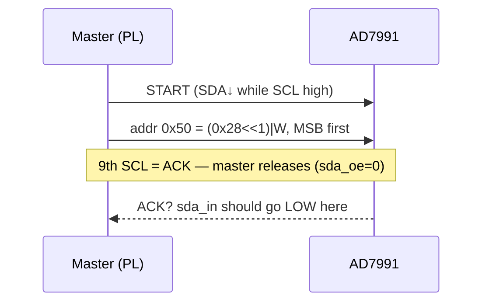

# I2C bring-up / scope harness (`i2c_test`)

A deliberately minimal PL-only bitstream that contains **only** `i2c_adc_driver`,
so we can finally *scope* the PMOD AD2 (AD7991-0) I2C bus and find out why every
PL-fabric attempt NACKs while the base-overlay `Pmod_IIC` succeeds on the same
wiring. See `handoffs/milestone_log.md` → "Hardware Debug Session 2".

There is **no AXI, no FIR, no PYNQ overlay** here. You drive it entirely from
the Vivado **Hardware Manager over JTAG**:

- **VIO** — `probe_out0` drives `start`; `probe_in0` = `adc_data[11:0]`,
  `probe_in1` = `adc_valid`.
- **ILA** — captures the bus + driver internals (`scl_r`, `sda_out`, `sda_oe`,
  `sda_in`, `state`, `bit_cnt`, `shift_reg`, `byte1`) via `mark_debug` nets.

## Build

```
vivado -mode batch -source vivado/create_i2c_test.tcl
```

Outputs `vivado/i2c_test.bit` and `vivado/i2c_test.ltx`.

## Hardware setup

- PMOD AD2 in the **right half of JB** (SCL→JB[2]=V10, SDA→JB[3]=W10).
- **Tie AD2 CH0 to VCC (3V3) or leave it floating** — this only sets the
  read-back value once the chip ACKs; it does not affect the ACK itself.

## Run

1. Hardware Manager → connect → program `i2c_test.bit`, then **load
   `i2c_test.ltx`** (probes) when prompted.
2. In the **ILA** dashboard, set the trigger to `u_i2c/state == 1` (decimal),
   i.e. `START_SDA_LO`, and arm it.
3. In the **VIO** dashboard, toggle `probe_out0` (start) **0 → 1**. Each rising
   edge fires exactly one I2C transaction (clean single capture).
4. Read `probe_in0`/`probe_in1` for the resulting `adc_data` / `adc_valid`.

## What to read off the ILA waveform (in order)



1. **START**: `sda_out`/`sda_in` fall while `scl_r` high → master drives the bus.
2. **Address byte**: `0x50` on the wire (`{7'h28,1'b0}`), MSB-first, data stable
   while `scl_r` high.
3. **9th SCL (ACK)**: with `sda_oe == 0` (master released the line), does
   `sda_in` go **LOW**?
   - **LOW** → slave ACKed. The old "NACK" theory was wrong; let the read run
     and confirm `adc_data` ≈ `0xFFF` (CH0=VCC) / noise (floating).
   - **stays HIGH** → genuine NACK at the pad. Inspect SDA/SCL **rise time**
     and edge cleanliness — slow/rounded rise (weak internal PULLUP vs cable
     capacitance) is the leading suspect.

## Decision tree (do NOT change anything until the capture is read)

| Observation | Conclusion / next move |
|---|---|
| Slow / rounded SDA-SCL rises | Add external **4.7 kΩ** pull-ups to 3V3; re-capture. |
| Clean edges but slave NACKs | Revisit AD2 internal pin-short / unused-JB-pin hypothesis (log item #6). |
| `sda_oe` wrong on the ACK clock (master never releases) | Only *then* is it an RTL bug in `i2c_adc_driver.v`. |

## Notes

- `pl/i2c_adc_driver.v` carries `(* mark_debug *)` synthesis pragmas only — no
  behavioral change. If the scripted ILA insertion in `create_i2c_test.tcl`
  ever fails, you can fall back to Vivado's GUI **Set Up Debug** wizard, which
  auto-detects the same `mark_debug` nets.
- Independent of the main `ecg_demo` design — does not touch `ps/`.
